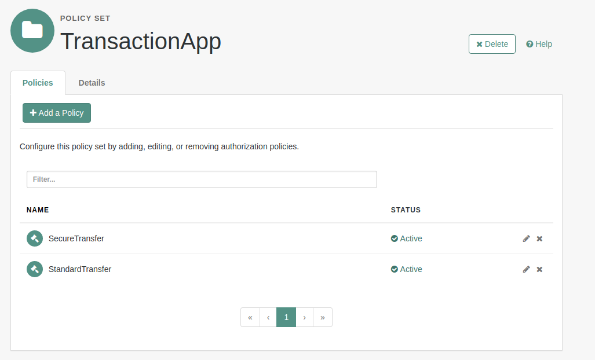

<b>Transaction-Demo App</b>
 
A simple single-page-app, that uses the push authorization functionality in AM 5.5.
 
 
<b>Installation</b>
 
Git clone into the ../webapps/ directory of Tomcat (or similar container).  Navivate to ../transaction-demo on deployed server.  Note deploy in same container as the AM you are testing against, as no CORS configuration has been completed, so assumes same host.
 
 

 
 
Set up an authentication chain called "pushService" - with just the Push Authentication module. (also setup a pushReg service for registration if necessary).  The app relies on two resource types being configured and one policy set as follows:
 
 
Standard Transfer Resource Type:
 

 
 
Secure Transfer Resource Type:
 

 
 
Transaction App Policy Set:
 

 
 
Secure Transfer Policy
 

 
 
Standard Transfer Policy
 

 
 
<b>Usage</b>
 
Login in with username and password with a user previously registered.  This will allow transfer of units up to 50 in one go, as many times as you like, as long as the session is valid.  For every value over 50, a push notification is sent to the mobile of the registered user.  The app polls AM until the push has completed before updating the balance.
 
 
<b>Disclaimer</b>
The sample code described herein is provided on an "as is" basis, without warranty of any kind, to the fullest extent permitted by law. ForgeRock does not warrant or guarantee the individual success developers may have in implementing the sample code on their development platforms or in production configurations.

ForgeRock does not warrant, guarantee or make any representations regarding the use, results of use, accuracy, timeliness or completeness of any data or information relating to the sample code. ForgeRock disclaims all warranties, expressed or implied, and in particular, disclaims all warranties of merchantability, and warranties related to the code, or any service or software related thereto.

ForgeRock shall not be liable for any direct, indirect or consequential damages or costs of any type arising out of any action taken by you or others related to the sample code.